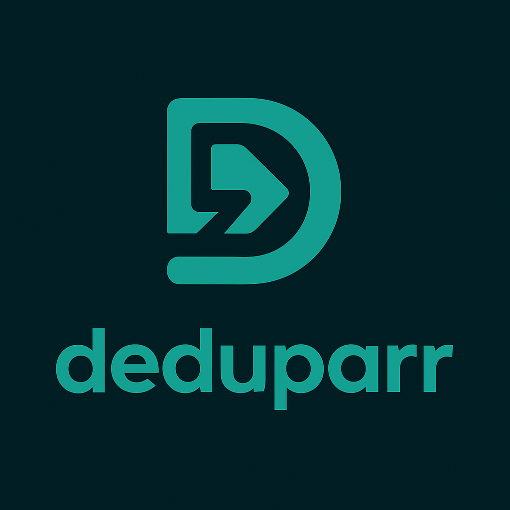

<p align="center">
  
</p>

<p align="center">
  <strong>Intelligent Duplicate Management for the *arr Stack</strong>
</p>

<p align="center">
  <a href="https://github.com/deduparr-dev/deduparr/stargazers"></a>
  <a href="https://github.com/deduparr-dev/deduparr/issues"></a>
  <a href="https://github.com/deduparr-dev/deduparr/blob/main/LICENSE"></a>
  <a href="https://github.com/deduparr-dev/deduparr"></a>
  <a href="https://github.com/deduparr-dev/deduparr"></a>
</p>

---

## 🎯 What is Deduparr?

**Deduparr** is a Docker-based web application that finds and manages duplicate media files across your entire media stack. It seamlessly integrates with Plex, Radarr, Sonarr, and qBittorrent to provide intelligent, safe duplicate management with a modern web interface.

### The Problem

You use Radarr/Sonarr to automatically upgrade your media quality, but they keep **both versions**:
1. Radarr downloads a movie in 1080p
2. Two months later, it finds a 4K version and acquires that too
3. Now you have duplicates eating up storage space
4. The old files stay in media library, qBittorrent, Radarr, AND on disk

### The Solution

Deduparr finds these duplicates, scores them based on quality, and **safely removes the lower-quality versions** from:
- ✅ **qBittorrent** - Removes the library item
- ✅ **Radarr/Sonarr** - Deletes the file entry
- ✅ **Filesystem** - Removes the actual file
- ✅ **Media Library** - Refreshes the collection

All with a beautiful web UI and dry-run mode for safety!

---

## ✨ Features

- 🔍 **Smart Duplicate Detection** - Scan media libraries for duplicates with configurable quality scoring
- ✅ **Safe Review System** - Dry-run mode by default, preview before deletion
- 🗑️ **Multi-Stage Deletion** - Removes from qBittorrent, Radarr/Sonarr, disk, and refreshes media library
- 📊 **Dashboard & Analytics** - Track duplicates found, space reclaimed, and activity history
- ⚙️ **Easy Setup** - Setup wizard with OAuth authentication and connection testing
- 🔒 **Secure** - Enterprise-grade token encryption and type-safe code

---

## 🏗️ Architecture

- **Backend:** Python 3.13 + FastAPI + SQLAlchemy
- **Frontend:** React + TypeScript + TailwindCSS + shadcn/ui
- **Database:** SQLite (default) / PostgreSQL (optional)
- **Deployment:** Docker + Docker Compose

---

## 🚀 Quick Start

### Prerequisites

- Docker and Docker Compose
- Plex Media Server
- Radarr and/or Sonarr
- qBittorrent

### Installation

Create a `docker-compose.yml`:

```yaml
services:
  deduparr:
    image: ghcr.io/deduparr-dev/deduparr:latest
    container_name: deduparr
    environment:
      - PUID=1000
      - PGID=1000
      - TZ=Etc/UTC
      - DATABASE_TYPE=sqlite  # or 'postgres'
      # Optional: Enable scheduled scans
      - ENABLE_SCHEDULED_SCANS=false
      - SCAN_INTERVAL_HOURS=24
    volumes:
      - ./config:/config
      - ./data:/app/data
      - /path/to/media:/media:rw  # Use :ro for API-only deletion, :rw for full cleanup
    ports:
      - 8655:8655
    restart: unless-stopped
```

> **Media Mount:** Use `:rw` (recommended) for complete cleanup including associated files and empty directories. Use `:ro` if you only want API-based deletion via Radarr/Sonarr/qBittorrent. See [DEPLOYMENT.md](DEPLOYMENT.md#media-mount-permissions-ro-vs-rw) for details.

2. **Start the container:**

```bash
docker-compose up -d
```

3. **Access the setup wizard:**

```
http://127.0.0.1:8655/setup
```

## 🚀 Getting Started

The setup wizard will guide you through initial configuration.

### Setup Wizard

On first run, the setup wizard guides you through configuration:

1. **Plex Authentication** - OAuth sign-in
2. **Server Selection** - Choose your Plex server
3. **Library Selection** - Pick which libraries to scan
4. **Service Configuration** - Connect qBittorrent, Radarr, and/or Sonarr
5. **Complete** - Start using Deduparr!

All services work together to safely remove duplicates across your entire media stack.

---

## 📖 Documentation

- [API Usage Examples](docs/API_USAGE_EXAMPLES.md) - Complete guide to the duplicate detection and deletion API
- [Docker Testing Guide](docs/DOCKER_TESTING.md) - Docker development and deployment instructions
- [Contributing Guidelines](CONTRIBUTING.md) - How to contribute to the project
- [Security Policy](docs/SECURITY.md) - Security practices and vulnerability reporting

---

## 🤝 Contributing

Contributions are welcome! See [CONTRIBUTING.md](CONTRIBUTING.md) for development guidelines and [docs/SECURITY.md](docs/SECURITY.md) for security policy.

**Quick Start:**
```bash
git clone https://github.com/deduparr-dev/deduparr.git
cd deduparr
docker-compose -f docker-compose.dev.yml up
```

Frontend: http://localhost:3000 | Backend: http://localhost:3001

---

##  License

MIT License - see [LICENSE](LICENSE) for details.

---

## 💬 Community

- [GitHub Discussions](https://github.com/deduparr-dev/deduparr/discussions) - Ask questions and share ideas
- [Issues](https://github.com/deduparr-dev/deduparr/issues) - Report bugs or request features

---

<p align="center">
  Made with ❤️ by the Deduparr community
</p>
